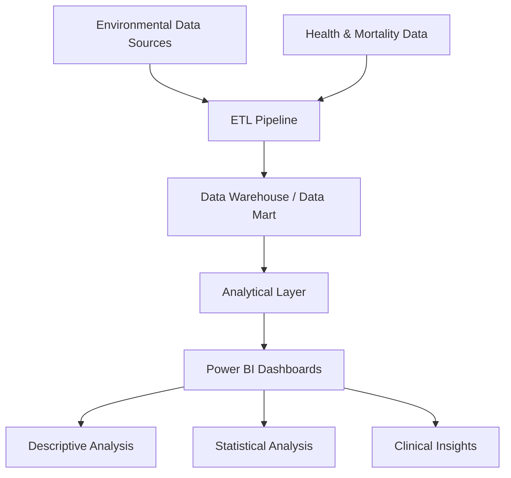

# 🌎 Environmental Health Analytics  
## Air Pollution and Respiratory Mortality in Bogotá (2015–2024)

Business Intelligence project analyzing the relationship between **air pollution exposure (PM₂.₅ and PM₁₀)** and **mortality due to chronic lower respiratory diseases** across Bogotá between **2015 and 2024**.

The project integrates environmental and health datasets into a **multidimensional analytical model**, enabling descriptive, statistical, and clinical analysis through interactive dashboards.

---

# 📌 Overview

Air pollution is one of the main environmental health risks in large cities.  
This project explores whether **particulate matter exposure (PM₂.₅ and PM₁₀)** is associated with **mortality due to chronic lower respiratory diseases (CLRD)** in Bogotá.

The solution was developed using a **Business Intelligence architecture** including:

- Data ingestion from environmental and health datasets
- ETL pipelines for data transformation
- A multidimensional **Data Mart**
- Interactive dashboards for exploratory analysis

The final outputs support **public health monitoring and environmental policy decision-making**.

---

# ❓ Research Question

```text
Is there an association between exposure to particulate matter (PM₂.₅ and PM₁₀)
and mortality due to chronic lower respiratory diseases in Bogotá's localities
between 2015 and 2024?
```

---

# 🎯 Objectives

## General Objective

Develop a **Business Intelligence solution** that allows monitoring and analysis of environmental pollution indicators and their relationship with health outcomes.

## Specific Objectives

- Analyze **temporal and demographic patterns** of mortality caused by chronic lower respiratory diseases.
- Evaluate the **statistical relationship between pollution levels and mortality rates**.
- Identify **localities with the highest health impact**.
- Design a **multidimensional model** for analytical exploration.
- Implement **ETL processes and a Data Mart** for data integration.

---

# 🏗️ Project Architecture

The project follows a standard **BI pipeline architecture**:



---

# 🗄️ Dimensional Model

The analytical model was designed using **dimensional modeling principles**.

## Grain

```text
Each record represents mortality aggregated by:
- Year
- Locality
- Demographic attributes
- Pollution indicators (PM₂.₅ / PM₁₀)
```

## Fact Table

```text
Fact_Mortality
Measures:
- Number of deaths
- PM₂.₅ levels
- PM₁₀ levels
```

## Dimensions

```text
Dim_Time
Dim_Location
Dim_Demographics
Dim_Pollution
```

---

# 📊 Analytical Approach

The project includes **three types of analysis**.

## 1️⃣ Descriptive Analysis

Exploration of mortality patterns across time, demographics, and geography.

Key findings:

- Mortality fluctuated between **2015–2024**
- Peaks observed in **2019 and 2023**
- **51% of deaths correspond to males**
- Highest mortality among **people aged 70+**
- Localities with highest mortality:
  - Kennedy
  - Suba
  - Engativá
  - Ciudad Bolívar

---

## 2️⃣ Statistical Analysis

Statistical methods were used to explore relationships between pollution exposure and mortality.

Findings:

- Positive correlation between **PM levels and mortality**
- **PM₁₀ shows a stronger association than PM₂.₅**
- Linear regression models indicate increasing mortality with higher pollution exposure

---

## 3️⃣ Clinical Analysis

Clinical interpretation of results highlights epidemiological patterns.

Key observations:

- The most affected localities remain consistent across years
- Disease burden is concentrated in **north and southwest Bogotá**
- Results support the need for **targeted environmental policies**

---

# 📂 Data Sources

Environmental datasets related to **air quality monitoring in Bogotá**.

Examples include:

- Bogotá environmental observatory datasets
- IDEAM air quality monitoring systems

These sources provide measurements for **PM₂.₅ and PM₁₀ concentrations** across different years and locations.

---

# 🛠️ Technologies Used


- Python
- SQL
- Power BI
- Cloud Data Platform
- ETL Pipelines
- Dimensional Modeling


---

# 📦 Project Deliverables

The project includes:

- Project documentation
- ETL design and implementation
- Multidimensional data model
- Interactive dashboards
- Final analytical report and presentation

---


Interdisciplinary collaboration between:

- Data / Engineering students
- Medical students

---

# 📄 License

This repository is intended for **academic purposes**.
